# Radar: Kubernetes UI, которого не хватало — разворачиваем в Yandex Managed K8s за 10 минут

## Введение

У каждого, кто работает с Kubernetes, рано или поздно возникает потребность «посмотреть на кластер глазами»: кто с кем связан, почему под в CrashLoopBackOff, что изменилось за ночь, какие сертификаты истекают. Вариантов обычно два — Kubernetes Dashboard (слишком бедный) или Lens / Headlamp (десктопное приложение или тяжёлый стек с зависимостями). А kubectl-специалисты откапывают причины инцидентов в простынях YAML, где сигнал тонет в `managedFields` и `status.conditions`.

[Radar](https://github.com/skyhook-io/radar) — open-source UI для Kubernetes от Skyhook (YC W23). Один бинарник на Go, без регистрации и аккаунта, бесплатный навсегда. Топология кластера, браузер ресурсов, timeline событий, менеджер Helm-релизов, GitOps для Flux, карта трафика, аудит безопасности, анализ impact'а перед апгрейдом K8s и даже встроенный MCP-сервер, чтобы ИИ-агенты могли смотреть кластер глазами Radar вместо сырого kubectl.

В этой статье мы развернём Radar в Yandex Managed Kubernetes через Helm — с ingress-nginx и доменом из публичного IP — и разберём все основные экраны. Разворачиваемый инстанс — общий для команды разработчиков, поэтому конфигурация строго read-only: все write-права выключены, ИИ-агенты подключаются к read-only MCP.

## Radar vs Kubernetes Dashboard vs Lens vs Headlamp vs k9s

| Метрика | Radar | Kubernetes Dashboard | Lens | Headlamp | k9s |
|---------|-------|----------------------|------|----------|-----|
| Тип | Локальный бинарник + опция in-cluster | In-cluster web UI | Десктопное приложение (Electron) | Web UI / десктоп | TUI в терминале |
| RAM | < 128 MiB | ~100–200 MiB | 500+ MiB (Electron) | ~100–200 MiB | ~50 MiB |
| Аккаунт | Не нужен | Не нужен | Нужен Lens-аккаунт (IDE-функции) | Не нужен | Не нужен |
| Топология | ✅ (Resources + Traffic) | ❌ | Платно (Lens Charts/Paid) | ❌ | ❌ |
| Timeline | ✅ (memory/sqlite) | ❌ | ❌ | ❌ | ❌ |
| Helm diff | ✅ | ❌ | Частично | ❌ | ❌ |
| GitOps | ✅ (Flux) | ❌ | Частично (расширения) | Частично (плагины) | ❌ |
| Карта трафика | ✅ (Hubble/Istio/Beyla/Caretta) | ❌ | ❌ | ❌ | ❌ |
| Аудит | ✅ (31 проверка) | ❌ | ❌ | ❌ | ❌ |
| Upgrade impact | ✅ | ❌ | ❌ | ❌ | ❌ |
| Cost insights | ✅ (OpenCost) | ❌ | Платно | ❌ | ❌ |
| MCP-сервер | ✅ | ❌ | ❌ | ❌ | ❌ |
| Файлы образа | ✅ | ❌ | ❌ | ❌ | ❌ |
| RBAC-visibility | ✅ | ❌ | ❌ | ❌ | ❌ |
| Сетевая диагностика | ✅ | ❌ | ❌ | ❌ | ❌ |
| Автодетект CRD | ✅ | Частично | Частично | ✅ | Частично |
| Лицензия | Apache 2.0 | Apache 2.0 | Проприетарная (OSS-режим обрезан) | MIT | Apache 2.0 |

Radar не заменит Grafana с дашбордами метрик и не тянет на полноценный лог-агрегатор. Но для ежедневного «что происходит в кластере и почему» — это, пожалуй, самый быстрый и функциональный инструмент с нулевым порогом входа.

Отличительные особенности Radar:

- **Topology** — интерактивный граф связей ресурсов в реальном времени
- **Upgrade Impact** — проверка кластера перед апгрейдом K8s (18 проверок до версии 1.36)
- **MCP-сервер** — ИИ-агенты получают кластер в token-оптимизированном виде вместо сырого kubectl
- **Timeline** — единая лента событий и diff'ов изменений по ресурсам

> Предполагается, что у вас уже есть работающий кластер Yandex Managed Kubernetes с установленным ingress-nginx. Как его поставить — описано в любом базовом гайде по Yandex K8s; статья начинается с работающего кластера.

## VictoriaMetrics до Radar: зачем и как

Функции Cost Insights и MCP-инструмент `query_prometheus` требуют PromQL-совместимый бэкенд (Prometheus, VictoriaMetrics, Thanos, Mimir). Cтавим минимальный стек `victoria-metrics-k8s-stack` (vmagent + vmsingle + Grafana). Traffic-карта в этой статье работает через Hubble и Prometheus-бэкенд не использует.

### Шаг 2. Устанавливаем

```bash
helm upgrade --install vmks oci://ghcr.io/victoriametrics/helm-charts/victoria-metrics-k8s-stack \
  --namespace vmks --create-namespace \
  --version 0.90.2 \
  --wait --values vmks-values.yaml
```

### Шаг 3. Проверяем

```bash
# Поды стека
kubectl get pods -n vmks

# Пароль Grafana
kubectl get secret vmks-grafana -n vmks -o jsonpath='{.data.admin-password}' | base64 --decode; echo
```

Проверить, что Radar увидел бэкенд, можно в UI — MCP-инструмент `query_prometheus` начнёт отвечать на PromQL-запросы. Для Cost Insights дополнительно нужен OpenCost — см. раздел ниже.

## OpenCost: Cost Insights в рублях по тарифам Yandex Cloud

 Подробнее про OpenCost — [статья на Habr](https://habr.com/ru/articles/1009678/).

### Шаг 1. ConfigMap с ценами

До установки чарта, иначе будет ошибка:

```bash
kubectl create namespace opencost --dry-run=client -o yaml | kubectl apply -f -
kubectl apply -f custom-pricing-configmap.yaml
```

Ставки в ConfigMap — **почасовые** (₽/час за единицу): `CPU: 1.1529` — это тариф Yandex Cloud за vCPU-час, `RAM: 0.3074` — за ГБ-час. Размерность зависит от версии OpenCost (см. комментарий в `custom-pricing-configmap.yaml`): в **v1.121.0** cost-model перестала делить `CPU`/`RAM`/`GPU`/`storage` на 730 — до этой версии (включая чарт 2.5.29 с образом 1.121.1 — уже новая логика) значения нужно было указывать месячными (₽/мес). Если ставите OpenCost ≤ 1.120.0, умножьте ставки на 730.

Изменение ConfigMap подхватывается только при старте пода — после правки цен выполните `kubectl rollout restart deploy/opencost -n opencost`.

### Шаг 2. Устанавливаем

```bash
helm upgrade --install opencost oci://ghcr.io/opencost/charts/opencost \
  --namespace opencost \
  --version 2.5.29 \
  --wait --values opencost-values.yaml
```

### Шаг 3. Скрейпинг метрик

```bash
cat <<EOF > opencost-vmservicescrape.yaml
# VMServiceScrape — нативный для vmagent способ скрейпить /metrics OpenCost (порт 9003).
# ServiceMonitor из чарта OpenCost не работает: в этом кластере нет Prometheus Operator CRD,
# а vmagent из vmks-стека скрейпит по VMServiceScrape (selectAllByDefault: true).
# Метрики попадают в vmsingle → Radar Cost детектит node_total_hourly_cost и др.
# Применить ПОСЛЕ установки чарта OpenCost (scrape выбирает Service чарта по лейблам).
apiVersion: operator.victoriametrics.com/v1beta1
kind: VMServiceScrape
metadata:
  name: opencost
  namespace: opencost
  labels:
    app.kubernetes.io/name: opencost
    app.kubernetes.io/instance: opencost
spec:
  selector:
    matchLabels:
      app.kubernetes.io/name: opencost
      app.kubernetes.io/instance: opencost
  endpoints:
    - port: http
      path: /metrics
EOF
kubectl apply -f opencost-vmservicescrape.yaml
```

### Шаг 4. Проверяем

```bash
# Под OpenCost (2 контейнера: cost-model + UI)
kubectl get pods -n opencost

# Цены применились (должно быть 1.1529 — тариф Yandex Cloud за vCPU-час)
kubectl exec -n opencost deploy/opencost -c opencost -- \
  wget -qO- http://localhost:9003/metrics | grep node_cpu_hourly_cost

# Метрики дошли до vmsingle (Radar Cost Insights берёт их отсюда).
# 127.0.0.1 вместо localhost: busybox-wget в контейнере vmsingle резолвит localhost в IPv6 (::1),
# а victoria-metrics слушает только на IPv4 0.0.0.0:8428 — с localhost будет Connection refused.
kubectl exec -n vmks deploy/vmsingle-vmks-victoria-metrics-k8s-stack -- \
  wget -qO- 'http://127.0.0.1:8428/api/v1/query?query=node_total_hourly_cost'
```

Через ~10 минут вкладка **Cost** в Radar заполнится.

## Hubble (Cilium): источник данных для Traffic-карты

Traffic-карта рисует живые сетевые потоки между сервисами. Radar умеет собирать их из [Hubble (Cilium)](https://github.com/cilium/hubble), [Istio](https://github.com/istio/istio), [Caretta](https://github.com/aicoe-aiops/caretta) или [Grafana Beyla](https://github.com/grafana/beyla). В этом кластере используется Hubble: кластер создаётся в туннельном режиме Cilium (`network_implementation { cilium {} }` в Terraform), и Yandex Managed K8s сам ставит Cilium и Hubble Relay в `kube-system` — ничего дополнительно устанавливать не нужно.

Туннельный режим Cilium (VxLAN):

- eBPF вместо iptables: сетевые политики L3/L4/L7, фильтрация по DNS-имени
- Hubble из коробки: наблюдаемость сетевых событий (dropped flows, correlation с NetworkPolicies)
- Для сервисного аккаунта кластера обязательна роль `k8s.tunnelClusters.agent`

Для подключения Radar к hubble-relay в `radar-values.yaml` включён `rbac.portForward: true`: Radar детектит поды с лейблом `k8s-app=hubble-relay` и читает поток событий через port-forward. Prometheus-бэкенд для Traffic-карты при этом не используется. Важно: это право активировано только для Hubble — как пользовательская фича port forwarding не включён, сделать port-forward на произвольный под через UI нельзя.

Проверяем после создания кластера:

```bash
# Cilium и Hubble Relay работают (в kube-system)
kubectl get pods -n kube-system | grep -E 'cilium|hubble'
```

Откройте в Radar экран **Traffic**: Hubble детектится автоматически, и карта заполнится живыми рёбрами — кто с кем реально говорит прямо сейчас. Дополнительно Hubble даёт то, чего нет у метрических источников: dropped flows с указанием NetworkPolicy, которая заблокировала трафик, отображаются прямо на карте и коррелируются с политиками в Topology.

## Часть 1. In-cluster деплой в Yandex Managed K8s

### Шаг 1. Добавляем Helm-репозиторий

```bash
helm repo add skyhook https://skyhook-io.github.io/helm-charts
helm repo update
```

В этой статье используется чарт версии **1.11.0** (совпадает с версией приложения). Посмотреть все доступные версии:

```bash
helm search repo skyhook/radar --versions
```

### Шаг 2. Аутентификация

Radar может иметь аутентификацию. Варианты:

- **Basic auth** на уровне ingress-nginx (`nginx.ingress.io/auth-type: basic` + Secret с htpasswd) — самый быстрый способ закрыть UI
- **OIDC** (`auth.mode: oidc`) — вход через корпоративный IdP (Google, Okta, Dex, Keycloak), у каждого пользователя свой RBAC через Kubernetes impersonation

### Шаг 3. values-файл

Файл `radar-values.yaml`:

```yaml
ingress:
  enabled: true
  className: nginx
  hosts:
    - host: ваш-fqdn-url
      paths:
        - path: /
          pathType: Prefix

rbac:
  podLogs: true     # просмотр логов подов (включён по умолчанию)
  podExec: false    # терминал в подах — включайте осознанно
  secrets: false    # чтение Secrets — выключено по умолчанию
  helm: false       # Helm write-операции — выключено по умолчанию
  portForward: true # активирован только для Hubble Relay (Traffic-карта); port-forward через UI не включён

timeline:
  storage: memory

# Источник данных Traffic-карты — Hubble Relay (Cilium, туннельный режим кластера):
# Radar детектит поды с лейблом k8s-app=hubble-relay и подключается через port-forward,
# Prometheus-бэкенд не используется.

resources:
  limits:
    cpu: 500m
    memory: 512Mi
  requests:
    cpu: 100m
    memory: 128Mi
```

Из нестандартного здесь:

- `rbac.*` — все опасные права выключены по умолчанию: Radar стартует в read-only режиме (кроме логов — они нужны всегда)
- Инстанс рассчитан на всех разработчиков: доступ к общему Radar — read-only

### Шаг 4. Устанавливаем

```bash
helm upgrade --install radar skyhook/radar --version 1.11.0 \
  -n radar --create-namespace -f radar-values.yaml \
  --wait --timeout 5m
```

## Обзор экранов Radar

### Topology

Интерактивный граф связей ресурсов в реальном времени — визитная карточка Radar.

- Два режима: **Resources** (полная иерархия: Deployment → ReplicaSet → Pod, плюс ConfigMap'ы, Secrets, HPA, PDB) и **Traffic** (сетевой путь: Ingress/Gateway → HTTPRoute → Service → Pod)
- Группировка по namespace, app-лейблу или без неё
- Фильтр по типу ресурса, клик по ноду — полный details
- Авто-раскладка ELK.js, live-обновления через SSE

Именно здесь быстрее всего понимаешь «кто кого использует» в незнакомом namespace.

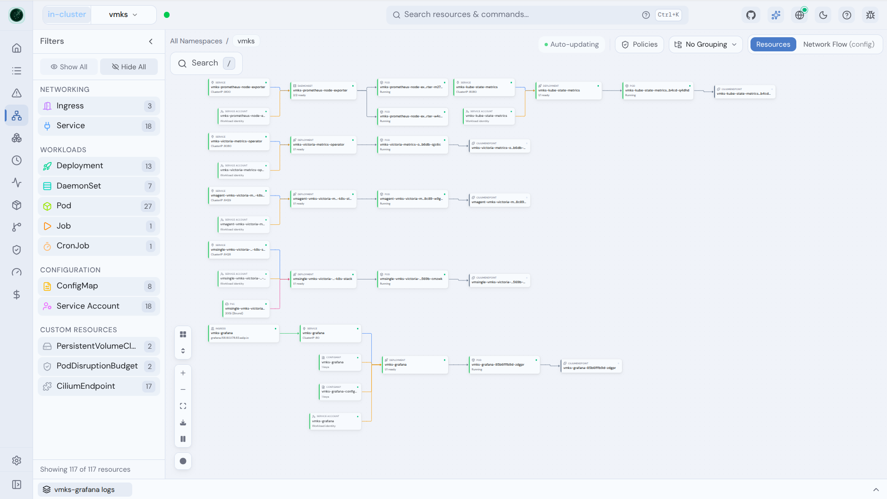

### Resources

Табличный браузер всех ресурсов кластера, включая CRD (Radar авто-детектит любые Custom Resources).

- Умные колонки для каждого типа ресурса
- Поиск по имени, фильтр по статусу и проблемам (CrashLoopBackOff, ImagePullBackOff, …)
- Кастомные колонки из любых лейблов и аннотаций
- Клик по ресурсу: YAML, related resources, логи, события

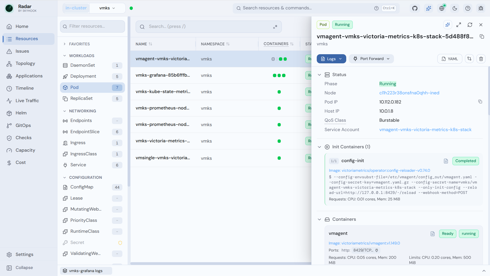

### Image Filesystem Viewer

Просмотр файловой системы container-образа прямо из Pod — без `docker pull` и `kubectl exec`.

- Дерево файлов с размерами, правами и symlink'ами
- Поиск файлов по всему образу
- Скачивание отдельных файлов
- Работает с приватными реестрами (GCR, ECR, ACR) через ImagePullSecrets кластера
- Дисковый кэш слоёв для повторного доступа

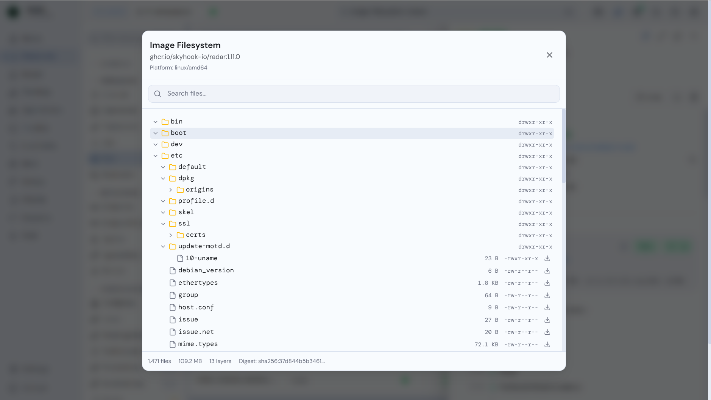

### Timeline

Единая лента событий Kubernetes и изменений ресурсов.

- Фильтр по типу (все / только warnings)
- Diff'ы изменений: что именно поменялось (replicas, images, …)
- Реальное время: новые события прилетают по SSE

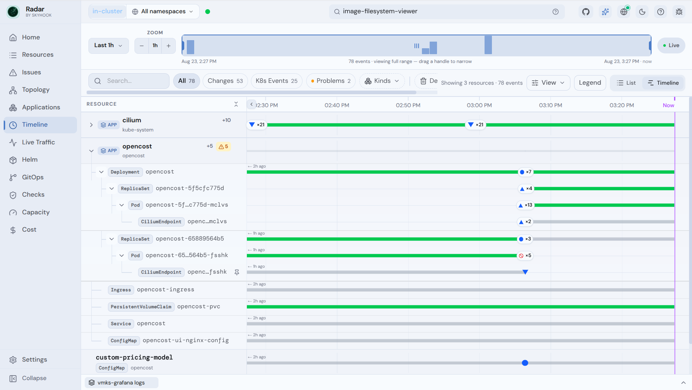

### Helm

Полноценный менеджер Helm-релизов кластера.

- Все релизы по namespace'ам: статус, версия чарта, health ресурсов
- Инспекция values, rendered-манифестов, diff ревизий
- История релиза, отслеживание failed upgrades и rollback-паттернов
- Диагностика зависших hooks с подами, событиями и логами


В read-only сетапе этой статьи вкладка Helm покажет «Access Restricted — Insufficient permissions to list Helm releases». Это ожидаемое поведение, а не сломанный RBAC. Причина: Helm хранит метаданные каждого релиза в Secret'ах типа `helm.sh/release.v1` в namespace релиза — поэтому даже «просто посмотреть список» — это операция чтения Secrets, а она в чарте выключена (`rbac.secrets: false`). Флаг `rbac.helm` здесь ни при чём: он отвечает только за write-операции (upgrade/rollback/uninstall) и в эту конфигурацию не входит.

Если список релизов всё же нужен — включите `rbac.secrets: true` в `radar-values.yaml.tftpl` и выполните `terraform apply`: Radar получит список релизов, values, rendered-манифесты и diff ревизий — по-прежнему read-only. Цена: Radar увидит **все** Secrets кластера, включая чувствительные (например, пароль админа Grafana из `vmks-grafana`).

### Compare

Diff любых двух ресурсов одного вида side-by-side: staging vs production Deployment, два «одинаковых» пода.

- Side-by-side или unified, swap A ↔ B в один клик
- Diff-only — сворачивает неизменённое
- Spec-only — отбрасывает `status`
- Шум (`managedFields`, `resourceVersion`) вычищается автоматически

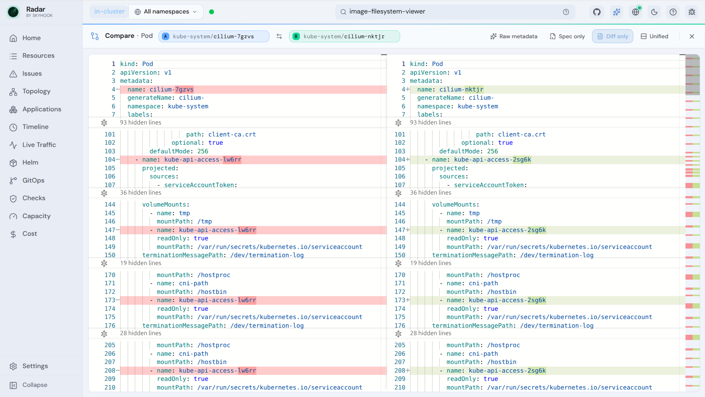

### TLS Certificates

Сроки действия TLS-сертификатов по всем namespace'ам — поймать истекающий сертификат до того, как он уронит прод.


### GitOps

Отдельный workspace для Flux.

- Fleet-вид + детальная страница по каждому приложению (Topology / Changes / Activity)
- Field-level drift, события, детект застрявших drift-лупов, parsed operation-failures
- Lifecycle-осознанность: `Terminating`-чипы, zombie-операции
- При подключении к API — Git-rendered desired-vs-live diff (`argocd.existingSecret` в values)


Управляющие действия (sync, suspend, resume, reconcile, rollback) в read-only сетапе статьи недоступны: ClusterRole выдаёт на Argo/Flux-группы только `get/list/watch`, а контроллер с автоматической синхронизацией делает изменения за вас.

### Traffic

Живая карта сетевого трафика между сервисами.

- Автодетект источников данных: Hubble (Cilium), Istio, Caretta, Grafana Beyla
- Анимированный граф requests-per-second между сервисами
- Фильтры по namespace, протоколу, status code
- Beyla даёт eBPF L4 + HTTP видимость без service mesh
- Setup wizard: если источник не найден — предложит установить

В этом кластере источник — Hubble (раздел выше): Radar детектит hubble-relay в `kube-system` и читает поток сетевых событий через port-forward. Рёбра графа утолщаются с ростом throughput и тускнеют, когда трафик останавливается; hover по ребру — p50/p95/p99 latency и top status codes. Дропнутые потоки отображаются с причиной (например, `POLICY_DENIED`) и коррелируются с NetworkPolicy, которая их заблокировала.

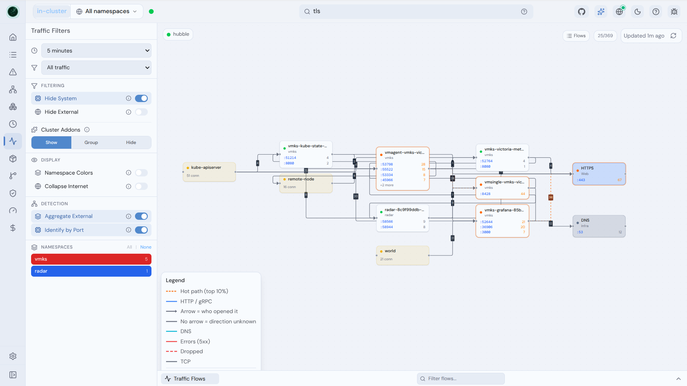

### Capacity (Karpenter)

Read-only диагностика Karpenter-флитов: почему под pending, какой NodePool его примет, что делает disruption. Появляется автоматически при детекте NodePool'ов (RBAC-gated). Каждое значение несёт маркер достоверности (`= ≥ ≤ ?`) — недоступное никогда не отображается как ноль.

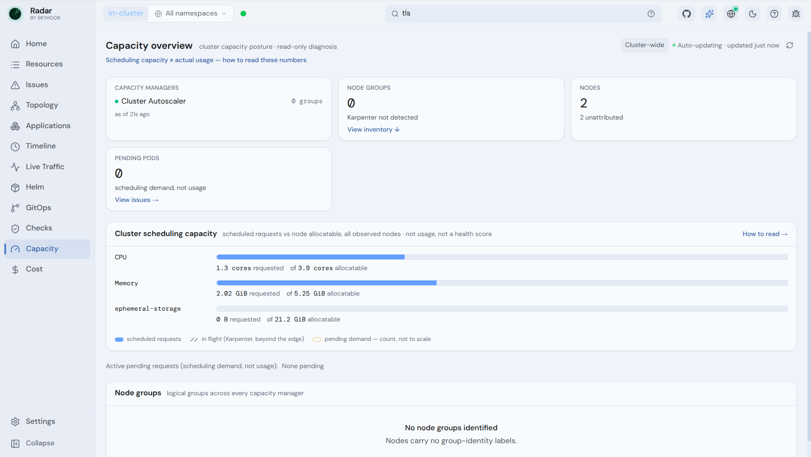

### Cost Insights

Интеграция с OpenCost: почасовая и месячная стоимость кластера, top namespaces по расходам, тренды (6h/24h/7d), разрезы по workload'ам и нодам. Появляется автоматически при детекте OpenCost-метрик в Prometheus. В этом кластере OpenCost развёрнут разделом выше с тарифами Yandex Cloud — стоимость отображается в рублях.

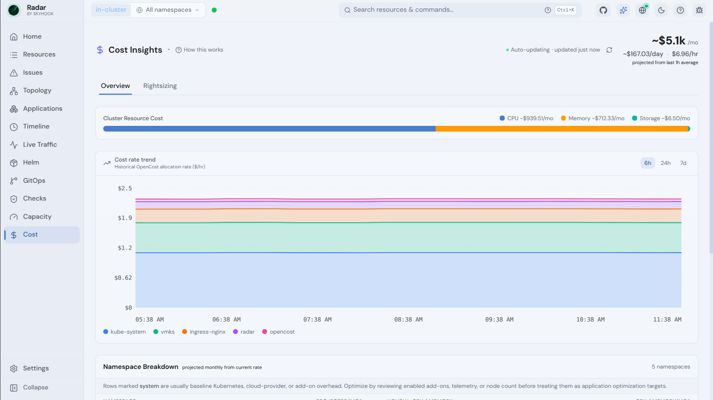

### Cluster Audit

Проактивный сканер best practices — 31 проверка по безопасности, надёжности и эффективности (вдохновлён Polaris, Kubescape, Trivy и NSA/CISA guidelines).

- Security: privileged-контейнеры, privilege escalation, опасные capabilities, host namespaces, маунты container runtime socket, секреты в ConfigMaps
- Reliability: отсутствующие probes, `latest`-теги, single-replica deployments, отсутствующие PDB
- Efficiency: отсутствующие requests/limits
- Каждый finding — с описанием и remediation-гайдом
- Фильтры по категории, severity, framework (NSA/CISA, CIS)


### Network Path Diagnose

Hop-by-hop диагностика для Service, Ingress, HTTPRoute, GRPCRoute и Gateway: «если трафик пойдёт в этот ресурс — долетит ли до healthy-процесса, и если нет, какой hop ломается первым?»

- Первый критический hop называется явно
- Опциональный one-shot reachability test: DNS / TCP / TLS / HTTP пробы (прямой TCP из in-cluster Radar, через API-server proxy — с ноутбука)
- NetworkPolicies статически оцениваются на «would block»
- Каждому finding'у прилагается kubectl-репродьюсер

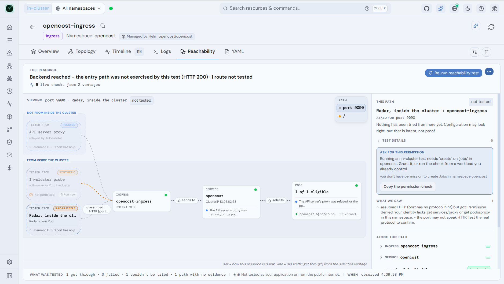

### Kubernetes Upgrade Impact

Открываете **Checks → Upgrade impact** перед апгрейдом control plane. Radar сравнивает кластер с целевой минорной версией K8s (каталог — 18 проверок до 1.36) и сортирует результат по требуемым действиям.

- Блокеры: скипнутые минорки, удалённые API, неподдерживаемый kubelet-skew, пересекающиеся PDB
- Влияние на эксплуатацию: FlexVolume, переименованные control-plane метрики
- Различает Passed / Review / Warning / Blocked / Incomplete / Not applicable

Для Yandex Managed K8s — прямая находка: перед апгрейдом мастер'а видно, что поедет.

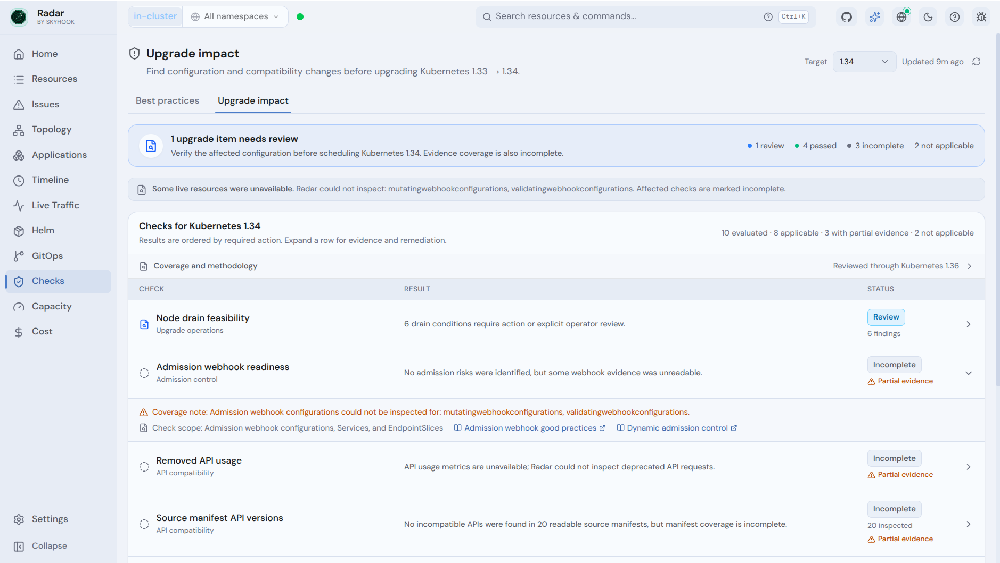

### Access Control (RBAC visibility)

Что реально может ServiceAccount — без трёх `kubectl describe`.

- SA detail: прямые bindings, effective permissions, наследование через implicit groups, «какие поды это используют»
- Pod detail: Permissions-секция + blast-radius alert, если у SA wildcards, cluster-admin или escalation-глаголы
- «My Permissions»: live `SelfSubjectRulesReview` для текущего юзера

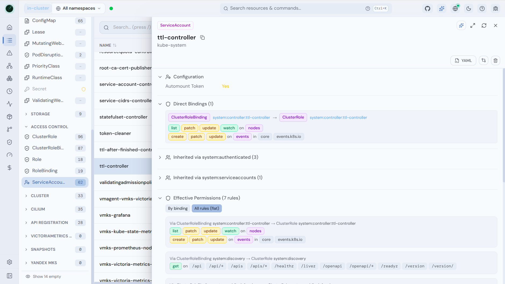

### AI Integration (MCP)

Встроенный Model Context Protocol-сервер — пожалуй, самая необычная фича Radar. ИИ-агенты (Claude, Cursor, Copilot, …) смотрят кластер не через сырой kubectl, а через token-оптимизированные данные Radar: топология, health-оценки, дедуплицированные события, отфильтрованные логи.

Для общего Radar на команду разработчиков подключать агентов нужно к read-only mount'у `/mcp-readonly`: он отдаёт только read-инструменты — write-инструменты (restart, scale, sync, …) даже не попадают в каталог, агент их не видит и не может вызвать. Полный mount `/mcp` на общий инстанс не подключайте: он экспортирует write-инструменты (RBAC вернёт 403, но агент будет их предлагать).

- Read-инструменты строго read-only (`readOnlyHint`)
- Secret-данные структурно никогда не отдаются; env-значения и логи скрабятся


Подключение к Claude Code:

```bash
claude mcp add radar --transport http http://ваш-fqdn-url/mcp-readonly
```

Claude Desktop (`claude_desktop_config.json`):

```json
{
  "mcpServers": {
    "radar": {
      "type": "http",
      "url": "http://ваш-fqdn-url/mcp-readonly"
    }
  }
}
```

Cursor (`~/.cursor/mcp.json`):

```json
{
  "mcpServers": {
    "radar": {
      "url": "http://ваш-fqdn-url/mcp-readonly"
    }
  }
}
```

Read-only каталог: `issues` («что сломано прямо сейчас?»), `diagnose` (root-cause одного workload'а в один вызов — с логами, событиями и startup-блокерами), `get_topology`, `get_neighborhood`, `list_helm_releases`, `get_cluster_audit`, `query_prometheus` и другие — всего ~25 read-инструментов.

## RBAC: что по умолчанию, а что opt-in

Чарт создаёт ClusterRole с read-only доступом к стандартным ресурсам (Pods, Deployments, Services, Events, Nodes, …) и ~45 группам CRD (Argo, Flux, cert-manager, Istio, Karpenter, KEDA, Velero, Crossplane, Kyverno, CloudNativePG, …). Опасные права выключены:

| Фича | Значение | По умолчанию |
|------|----------|--------------|
| Просмотр логов | `rbac.podLogs: true` | ✅ включён |
| Терминал в подах | `rbac.podExec: true` | ❌ выключен |
| Port forwarding | `rbac.portForward: true` | ✅ включён (активирован только для Hubble — Traffic-карта) |
| Чтение Secrets | `rbac.secrets: true` | ❌ выключен |
| Helm write (upgrade/rollback/uninstall) | `rbac.helm: true` | ❌ выключен |
| RBAC-объекты в браузере | `rbac.viewRBAC: true` | ❌ выключен |

Чтение Secrets — не только про сами Secrets в браузере: без него не работает и список Helm-релизов (см. раздел [Helm](#helm)).

Port forwarding здесь включён осознанно, и активирован он только для Hubble: это единственный способ in-cluster Radar читать поток Hubble Relay. Право даёт только `pods/portforward` — `create` на порт-форварды, без exec и логов. Port forwarding как пользовательская фича через UI не включён: сделать port-forward на произвольный под из браузера нельзя.

Radar умеет graceful degradation: namespace-scoped ServiceAccount полностью поддерживается — что можете листать, то и видите; недоступные типы показывают copyable-сниппет ClusterRole для кластер-админа вместо вранья «0 found».

## Timeline: memory vs sqlite

In-cluster Radar по умолчанию хранит timeline в памяти — рестарт пода стирает историю. Для мультидневного audit-trail включайте SQLite на PVC:

```yaml
timeline:
  storage: sqlite
  retention: 168h   # 7 дней; "0" — без очистки
  maxSize: 800Mi    # лимит DB + WAL

persistence:
  enabled: true
  size: 1Gi
```

Ограничение: `replicaCount` обязан быть 1 (чарт упадёт с ошибкой, если совместить PVC + SQLite с несколькими репликами). Контроль очистки — через `/api/diagnostics`: `timeline.storageBytes`, `timeline.lastCleanupDeletedRows`, `timeline.lastCleanupError`.

## Подключение Prometheus (Cost Insights)

Для Cost Insights нужны два компонента: PromQL-совместимый бэкенд (Prometheus, VictoriaMetrics, Thanos, Mimir) и OpenCost, чьи cost-метрики скрейпятся в этот бэкенд. Оба ставятся в этой статье автоматически: vmsingle из vmks-стека + OpenCost с VMServiceScrape (раздел [OpenCost](#opencost-cost-insights-в-рублях-по-тарифам-yandex-cloud)). Если автодетект не находит бэкенд, укажите URL явно:

```yaml
traffic:
  prometheusUrl: http://vmsingle-vmks-victoria-metrics-k8s-stack.vmks.svc:8429
  # Для защищённых паролем бэкендов — заголовки из Secret:
  # prometheusHeadersFromEnv:
  #   Authorization: PROMETHEUS_TOKEN
```

`query_prometheus` из MCP и `/prometheus/query` из REST работают с любым PromQL-совместимым бэкендом: Thanos, VictoriaMetrics, Mimir.


## Безопасность

- Radar читает кластер через ваш kubeconfig / ServiceAccount и держит данные локально — ничего не выгружается в Skyhook
- Account, agent, cloud-backend не нужны
- In-cluster обязательно ставьте за аутентификацией: basic auth на ingress, встроенные proxy/OIDC-режимы
- Terminal — значительный доступ, включайте только в доверенной среде; port forwarding в этой конфигурации активирован только для чтения потока Hubble Relay (Traffic-карта), через UI port-forward сделать нельзя
- Privileged-фичи по умолчанию выключены, всё включается явным `rbac.*` флагом

## Полезные ссылки:

- GitHub: [github.com/skyhook-io/radar](https://github.com/skyhook-io/radar)
- Документация: [radarhq.io/docs](https://radarhq.io/docs)
- Helm-чарт: [artifacthub.io/packages/helm/skyhook/radar](https://artifacthub.io/packages/helm/skyhook/radar)
- Discord-сообщество: [radarhq.io/community/chat](https://radarhq.io/community/chat)
